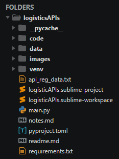
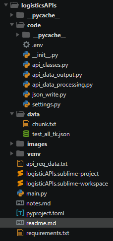

# Агрегация информации из API транспортных компаний

## Текущая архитектура



* main.py - главный модуль проекта, завязать запуск программы не него

* code\\.env - секреты, не тянуть при экспорте программы!

* code\\\_\_init\_\_.py - пакетный модуль со служебной информацией

* code\\api_classes.py - авторизация и запросы к API

* code\\api_data_output.py в данный момент используется для записи общего json в файл
и спагетти из code\\api_data_processing.py для вывода в txt, точкой выхода является директория data

* code\\api_data_processing.py - получает на вход сырой json, нормализует ключи, приводит к стандартизированному виду и на выходе получаем готовый к выводу json

* code\\json_write.py - модуль для получения сырого исходника со всеми данными всех ТК

* code\\settings.py - модуль с утилитами и константами для проекта

* data - директория с текстовой и json информаций полученной в результате работы скрипта

* venv - виртуальное окружения проекта

* api_reg_data.txt - юридическая и прочая информация связанная с владельцами API

* logisticAPIs.sublime-project - файл настройки проекта sublime text

* notes.md - на данный момент в нем реализован функционал отображения Mermaid в связке с sublime text пакетом Markdown Preview, в дальнейшем в нем можно отобразить ключевые структуры проекта и их связи

* pyproject.toml - создавался для конфигурации Ruff в sublime text, добавить стандартное наполнение

* requirements.txt - зависимости venv

### Текущие задачи
- [ ] структуризация директорий и файлов проекта

    - [ ] перенос констант и полезных функций в settings.py

- [ ] при разборе ошибок и поиске отсутствующих строк обратить внимание что критериями отбора заявок являются: промежуток дат и/или список статусов, который для каждой ТК разнится
    - [ ] создать общий библиотечный список статусов, разместить в settings.py

    - [ ] миксины/декораторы для критериев отбора отслеживаемых грузов

- [ ] Начать покрывать код докстрингами и генерировать документацию с помощью sphinx
    - [ ] класс BaikalApiV2 модуля api_classes.py покрыт комментами, попробовать сгенерировать документацию

- Общая задача для всех классов
    - [ ] После сбора полного сырого json покрыть тестами или try except блоками, чтобы отсечь исключения на самом начальном этапе, очень важное место

    - [ ] его в свою очередь собираем процессим и валидируем пайдентиком в финальные структуры, которые можно выводить во вне
        - [ ] добавить синтаксически верное (json) разделение общего файла с данными
            - [ ] разработать систему нейминга элементов для экспорта в HTML либо куда бы то ни было во вне, api_data_processing.py
        - [ ] продумываем и переписываем функционал модуля api_data_processing.py
            - [ ] читаем data/test_all_tk.json
            - [ ] определяем ключи полезные json
            - [ ] единообразно записываем
            - [ ] лексим/парсим  в json/html/txt/md для вывода
            - [ ] посмотреть в сторону миксинов, докораторов и/или организации нового класса парсера JSON

    - [ ] Создание класса Accelaror для api_data_processing.py (посмотреть паттерны) на примере данных Dellin API
        - [ ] [pydantic!!!!](https://docs.pydantic.dev/latest/concepts/json/#json-parsing)
        - [ ] dataclasses-json
        - [ ] [отработать статью](https://medium.com/@idelossantosruiz/mastering-json-in-python-oop-a-practical-guide-65b39e868c33)
        - [ ] [отработать статью](https://medium.com/@saschaschwarz_8182/rest-api-parsing-made-easy-with-pydantic-part-1-72b30d698554)

- [ ] делегирование задач тестировщику
### Среднеактуальные задачи
- [ ] Добавить в процессинг деловых, но можно и в другие тк - кейс когда груз для южного форпоста поступает не в Астрахань!

- [ ] Доступ к API Magic, но после рефакторинга и чистки существующего метода!

- [ ] Доступ к API cdek

- [ ] Доступ к API Vozovoz

- [ ] Решение по интеграции БСД и DPD

- [ ] продумать систему отлова исключений/ошибок

- [ ] добавить версионность и гит

- [ ] сделать программу полноценным python пакетом работа с pyproject.toml и \_\_init\_\_.py

- [ ] В текущей архитектуре не определено единой точки входа, рассмотреть вариант использования main.py верхнего уровня с общим классом вызова, с секретами и авторизацией в \_\_init\_\_.py и main.py

### Глобальные цели

- [ ] Аудит архитектуры всего приложения

- [ ] реализация каналов вывода информации
    - [x] текст (то что сейчас выполняет модуль api_data_processing.py)
    - [ ] html на локальном сервере
    - [x] json
    - [ ] тг-бот
    - [ ] почта

- [ ] парсинг сайтов ТК без API

- [ ] работа на уровне входящих счетов на оплату
продумать надо ли OCR для pdf, либо из собранной информации по плательщику вытаскивать счет по API

- [ ] покрытые докстрингами

- [ ] покрытые тестами

- [ ] создание документации проекта (sphinx)

- [ ] вдумчивый и аккуратный рефакторинг кода

- [ ] разработать систему оповещения поступившего груза

### Закрытые задачи
- (23-01-2026)
    - [x] проба sphinx, работа в rst, правка conf.py

    - [x] правка readme.md, подробное описание структуры проекта

    - [x] актуализация текущих задач по проекту, подготовка к делегированию части задач тестировщику

- (22-01-2026)
    - [x] в модуле api_data_processing.py функция pc_approaching_orders() записать информацию об оплате и услугах в список словарей для удобной репрезентации

- (20-01-2026)
    - [x] покрыть класс BaikalApiV2 модуля api_classes.py комментами

    - [x] повторить реализацию API Pecom от (19-01-2026) для class BaikalApiV2:

    - [x] затем парсим детальные урлы по полученному списку номеров, все это выводим в общий сырой json, это так же будет происходить в json_write.py

- (19-01-2026) API Pecom
    - [x] Сначала внутри базовых классов создаем отбор номеров грузов по дате
    видимо так сделать не получится, необходимо реализовать в json_write.py
    ПОЛУЧИЛОСЬ РЕАЛИЗОВАТЬ ОБЕ ВЕРСИИ: соответственно имена методов класса PecomApiV1:
        - fetch_detailed_data - тут необходимо подать ему на вход результат работы метода collect_cargocodes
        - fetch_detailed_data_hardcoded - он просто вызывается с уже готовыми входными атрибутами

    - [x] Получил детальную информацию по оплате, на основании нее нужно:
        - [x] забрать тестовый пример из main() api_classes.py
        - [x] поменять основной URL на cargos/status/
        - [x] переориентировать сбор данных именно по новому URL
        - [x] переписать вывод данных в json_write.py
        - [x] возможно для удобства переписать на самом верхнем уровне доступ к заказам по статусу, после отбора по дате!

- (18-01-2026) API Pecom
    - [x] в документации найден URL 'cargos/status/' по которому отображается фин информация

    - [x] вытащить плательщика и статус оплаты на верхний уровень цикла
на основании функции доступа к api байкала
    ```
    from api_classes import BaikalApiV2, BK_SECRET_KEY

    b = BaikalApiV2(BK_SECRET_KEY)
    bk_current_orders = b.get_oreders_list()
    def bc_approaching_orders(bk_current_orders):
        s = ""
        for i in bk_current_orders["orderList"]:
            # Детальная информация по отдельным перевозкам для интеграции в
            # общий вывод
            detailed_orders_info = b.get_order_info(i["number"])

            # дата отправления
            # параметры груза
            places = detailed_orders_info["cargoList"][0]["cargo"]["places"]
            weight = detailed_orders_info["cargoList"][0]["cargo"]["weight"]
            volume = detailed_orders_info["cargoList"][0]["cargo"]["volume"]
            character = detailed_orders_info["cargoList"][0]["cargo"]["сharacter"]["name"]
            payer = (
                detailed_orders_info["cargoList"][0]["services"][0]["payer"]["name"]
                .upper()
                .replace("АКЦИОНЕРНОЕ ОБЩЕСТВО", "")
                .replace("ОБЩЕСТВО С ОГРАНИЧЕННОЙ ОТВЕТСТВЕННОСТЬЮ", "")
                .replace("ЗАКРЫТОЕ АКЦИОНЕРНОЕ ОБЩЕСТВО", "")
                .replace("ОТКРЫТОЕ АКЦИОНЕРНОЕ ОБЩЕСТВО", "")
                .replace('"', "")
                .strip()
                .replace(" ", "-")
            )

            paidStatus = detailed_orders_info["paidStatus"]
    ```

- (17-01-2026) API байкал
    - [x] выяснить почему не показывает статус "прибыл"

    - [x] в функции bc_approaching_orders модуля api_data_processing.py был получен и выведен в отображение ID статуса перевозки
    - [x] найти в документации запрос всех статусов заявки/перевозки и протестировать
    !!!таких данных в официальной документации к API не предоставлено!!!
    - [x] реверс инжиниринг сайта https://lk.baikalsr.ru/lk на предмет нахождения названий и ID статусов грузов
    по результатам реверс инжиниринга была получен словарь соответствия ID: название
    ```
    {"0": "Нет данных",
    "4": "Груз принят к перевозке",
    "5": "Груз в пути",
    "6": "Груз прибыл",
    "7": "Груз на доставке",
    "10": "Груз перенаправляется на терминал",
    "11": "Груз передан в службу доставки",
    "12": "Груз прибыл в ПВЗ",
    "8": "Груз выдан",
    "9": "Груз передан в службу универсальной",
    "13": "Груз доставлен",}
    ```

- [x] (15-01-2026) добавить таймштампы в общий json

- [x] (14-01-2026) обработка исключений функции get_all_data_in_json модуля json_write.py
